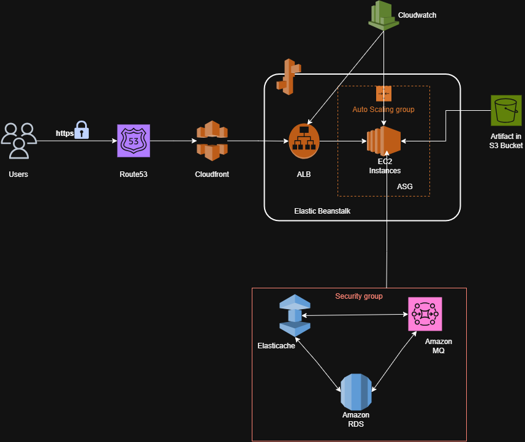

# vProfile Cloud-Native Deployment: AWS Managed Services (PaaS)

This project represents an advanced migration of the **vProfile Java Stack** from a traditional Lift & Shift model to a modern, scalable architecture using **AWS Managed Services**. By offloading management to AWS (RDS, MQ, ElastiCache), we achieve higher availability and lower operational overhead.

## 🏗️ Architecture Diagram

Below is the technical architecture showing the interaction between the application tier and the managed data services.

---

## ☁️ AWS Services Deep Dive

### 1. **Elastic Beanstalk (The Orchestrator)**
* **Role:** Acts as the Platform-as-a-Service (PaaS) to host our Java/Tomcat application.
* **Key Feature:** It automatically handles the deployment, capacity provisioning, load balancing (ALB), and auto-scaling.
* **Why?** It allows developers to focus on code rather than managing underlying EC2 instances and OS patching.

### 2. **Amazon MQ (The Message Broker)**
* **Protocol:** RabbitMQ.
* **Configuration:** Deployed using **AMQPS (Port 5671)** for secure, encrypted messaging.
* **Role:** Handles asynchronous communication and decoupling between application components.
* **Challenge Solved:** Managed SSL/TLS handshake issues by configuring the application to support encrypted connections to the broker.

### 3. **Amazon RDS (The Source of Truth)**
* **Engine:** MySQL.
* **Role:** A managed relational database for persistent data storage (Users, Profiles, etc.).
* **Security:** Isolated in a private subnet, accepting traffic only from the Elastic Beanstalk Security Group on port 3306.

### 4. **Amazon ElastiCache (The Speed Layer)**
* **Engine:** Memcached.
* **Role:** Implements the **Cache-Aside Pattern** to reduce database load and improve response times for frequently accessed data.
* **Performance:** Provides sub-millisecond latency for session management and data caching.

---

## 🔒 Security Architecture (Security-in-Depth)

The project implements a strict security model:
* **SSL Termination:** Handled at the Load Balancer level for HTTPS traffic.
* **Security Group Referencing:** The backend services (RDS, MQ, Cache) do not use IP-based rules. Instead, they reference the **Elastic Beanstalk Security Group ID**, ensuring only our app tier can communicate with the data layer.
* **Encryption in Transit:** All traffic to Amazon MQ is encrypted using **TLS** over port 5671.

---

## 🚀 How to Run
1.  **Clone the repo:** `git clone ...`
2.  **Build the Artifact:** `mvn clean install`
3.  **Configure Environment:** Update `application.properties` with the AWS Endpoints.
4.  **Deploy:** Upload the `.war` file to your Elastic Beanstalk environment.